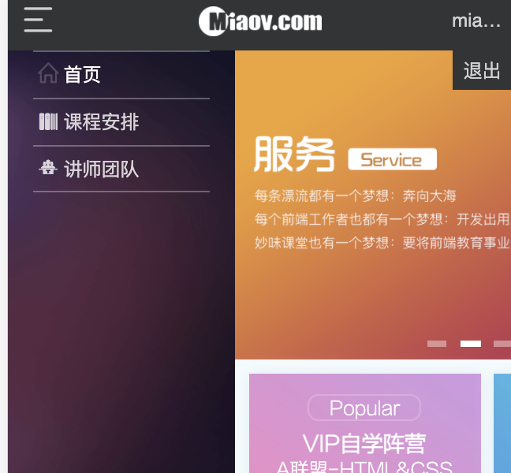
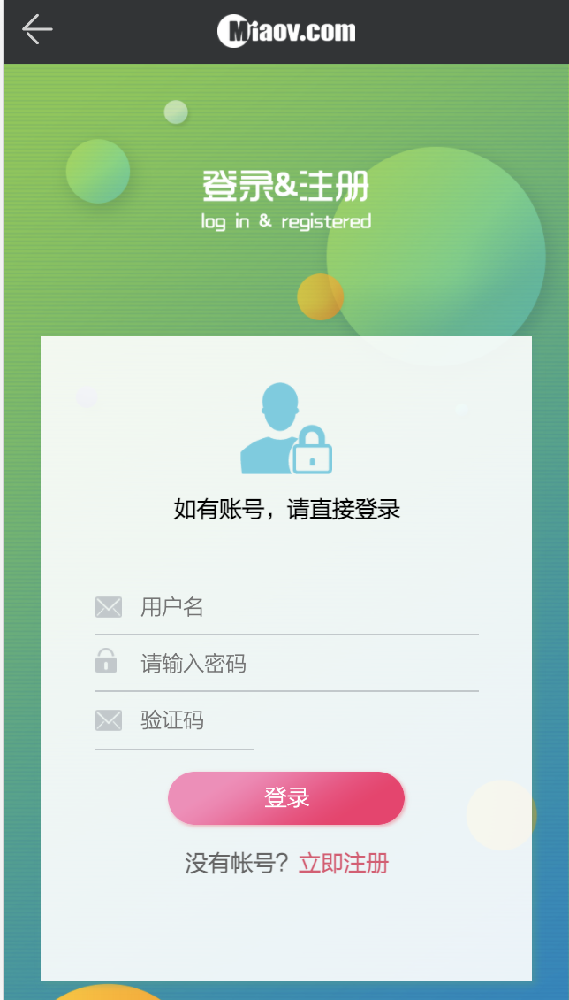

### 前言
> 这是一个仿移动端小项目，里面包括首页，作品展示及评论页，导师展示页，以及登陆注册页面。

### 依赖模块

<span style="color: rgb(184,49,47);">项目是用 create-react-app 创建的，主要还是列出新加的功能依赖包</span>

<span style="color: rgb(184,49,47);">点击名称可跳转相关网站 😄😄</span>

-   [react](https://facebook.github.io/react/)
-   [react-router](https://react-guide.github.io/react-router-cn/)(<span style="color: rgb(243,121,52);">react 路由，4.x 的版本，如果还使用 3.x 的版本，请切换分支（ps:分支不再维护）</span>)
-   [redux](https://redux.js.org/)(基础用法，但是封装了通用 action 和 reducer，demo 中主要用于权限控制（ps：目前可以用 16.x 的 context api 代替），可以简单了解下)
-   [axios](https://github.com/mzabriskie/axios)(<span style="color: rgb(243,121,52);">http 请求模块，可用于前端任何场景，很强大 👍</span>)
-   [better-scroll](https://github.com/ustbhuangyi/better-scroll) BetterScroll是一个插件，旨在解决移动端的滚动情况
-   [http-proxy-middleware](https://github.com/facebook/create-react-app/blob/master/docusaurus/docs/proxying-api-requests-in-development.md)http-proxy-middleware是create-react-app 提供的解决跨域的方法

-   其他小细节省略

### 功能截图

#### 首页



#### 轮播图


#### 作品展示及评论


#### 登陆注册




### 代码目录

```js
+-- node_modules/                           ---npm下载文件目录
+-- public/
|   --- index.html							---首页入口html文件
+-- src/                                    ---核心代码目录
|   +-- common                              ---公共模块
|    |   +-- component                      ---各式各样的组件存放目录
|    |   |    |    --- ...
|    |   |    +-- frame.js                  ---框架组件
|    |   |    |    --- ...
|    |   |    +-- header.js                 ---头部组件
|    |   |    |    --- ...
|    |   |    +-- menu.js                   ---左边菜单组件
|    |   |    |    --- ...
|    |   |    +-- skeleton.js               ---骨架屏组件
|    |   |    |    --- ...
|    |   |    +-- tab.js                    ---轮播组件
|    |   |    |    --- ...
|    |   +-- css                            ---项目的样式存放目录
|    |   +-- font                           ---项目的字体式存放目录
|    |   +-- hook                           ---公共方法
|    |   +-- images                         ---项目的图片存放目录
|   --- App.js                              ---组件入口文件
|   --- index.js                            ---项目的整体js入口文件，包括路由配置等
|   --- package.json
|   --- yarn.lock                           ---版本锁
```

### 安装运行

##### 1.下载或克隆项目源码

##### 2.yarn 安装依赖(国内建议增加淘宝镜像源，不然很慢，你懂的 😁)

> 有些老铁遇到运行时报错，首先确定下是不是最新稳定版的 nodejs 和 yarn，切记不要用 cnpm

```js
// 首推荐使用yarn装包，避免自动升级依赖包
yarn;
```

##### 3.启动项目

```js
yarn start
```
### 结尾

该项目会不定时更新，后续时间会添加更多的模块
